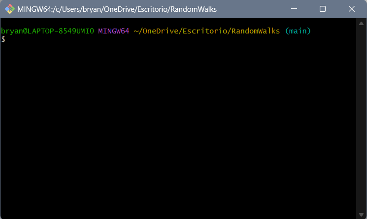

# Pseudo-random numbers generator

This program generate pseudo-random number by 5 methods: Mean squares, linear congruential method,
multiplicative congruential, uniform and normal distribution methods. 

### For use the program you should follow the next steps:
## Clone the Project

1. Go to your desktop or an empty folder and right-click to display the pop-up 
   menu where you will select the "Open Git Bash here" option. 
     
     

    

2. In the terminal, type the following command:

    `git clone https://github.com/brayooo/PseudoRandomNumberGenerator.git`
    And wait for it to finish cloning the entire project from the repository

3. When you finish cloning, the project folder should appear.

    

## Install required Python Libraries

If you are using windows you better use a **bash** terminal or if
you already have the configuration done of your windows cmd to works
with python, go ahead.

### Let's check that pip is installed
- Open a **bash** into the project and type:

    

      > pip show pip
    
    If you have it installed, you should see general information about this library. Like this:
    
    

    If nothing comes out, you must install pip.

    
- Install requirements:

      > pip -r install requirements.txt
    
    
    
    ### Now you're up to use the project.

## Running the Project

- Open the project with the **IDE** or **Development Environment** you want.
- You'll see the main.py file.
- You can run the file with the command
      
      > python main.py

- Or you can run the file using the run configuration of your IDE.

Perfect, if everything goes well and if you followed the steps you can see the user interface,
you're ready to use the program to generate pseudo-random numbers.

          

## Important

The program saves the numbers it generates with the parameters that you entered when you click the `Generate` button.

Once you press the button, the program creates `NumberGenerated` folder where the files are saved.

The files are saved with name of the method that generated them. **All the files have a .json extension**

## Author

- Bryan Lopez

**Simulación de Computadores - Grupo 1**